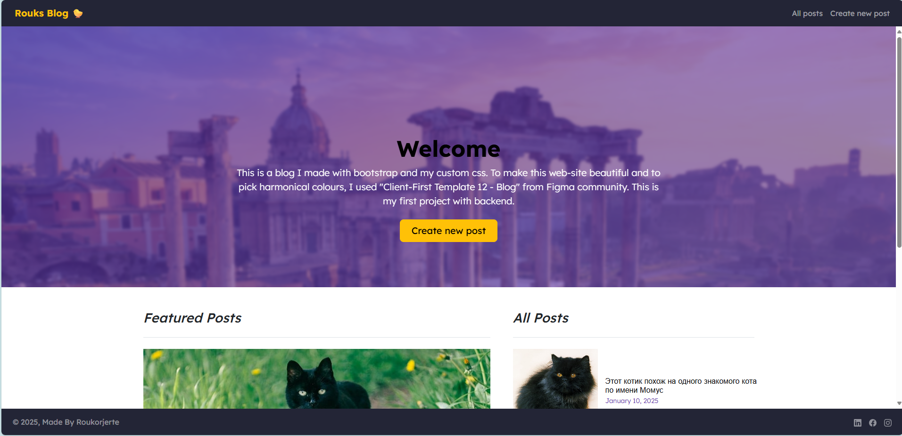
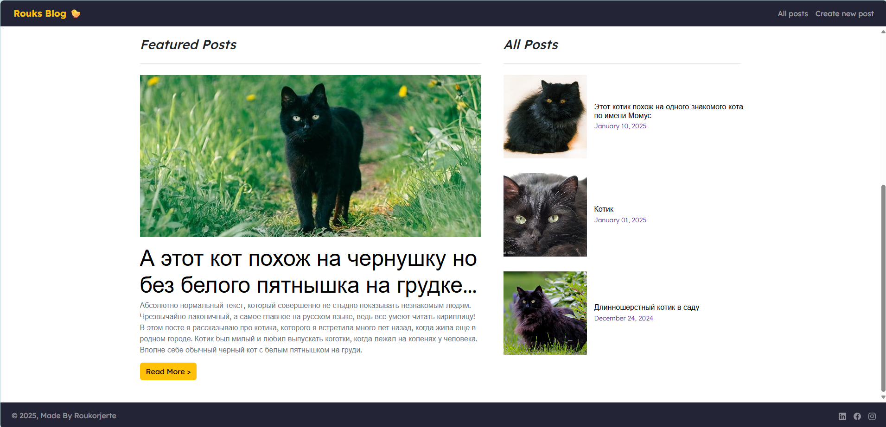
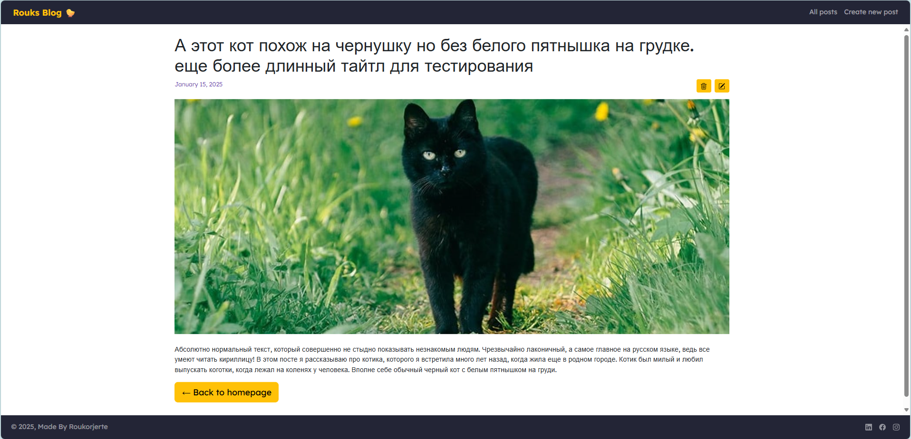
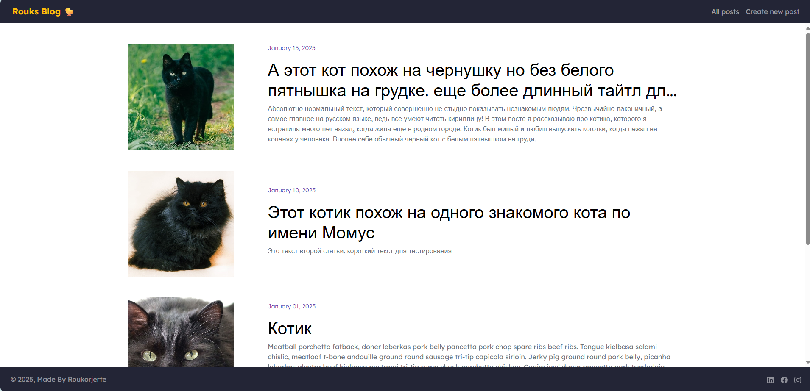
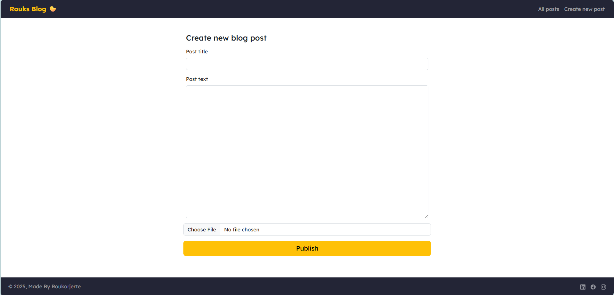
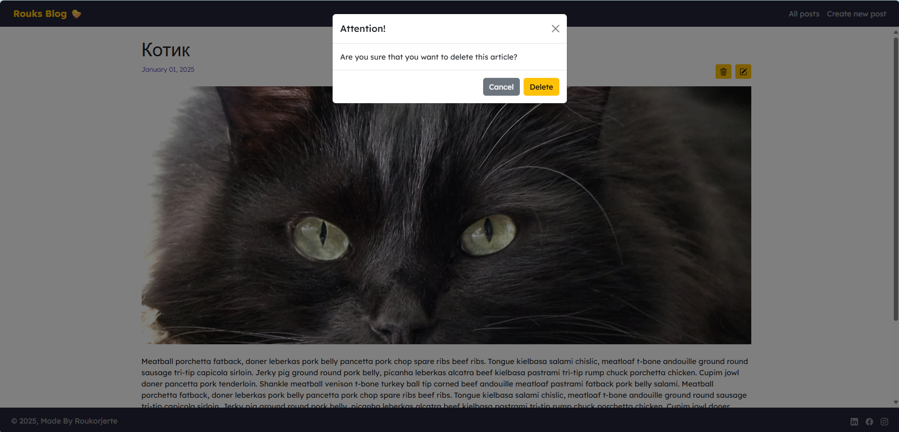

# 📝 Simple Responsive Blog with Bootstrap and EJS

A simple, fully responsive blog built with Bootstrap and EJS templating engine.  
Supports basic CRUD operations for posts with image attachments and basic filtering on homepage.

---

## 📸 Screenshots

  
*Homepage hero section*
 
*Homepage posts selection*

*Individual post page*

*All posts page*

*Edit or create posts page*

*Delete post modal*

*Adaptivity of homepage for different devices*

---

## 🛠 Technologies Used

- Bootstrap 5  
- EJS templating engine  
- Node.js + Express.js  
- Data stored in a JSON file

---

## ✨ Features

- Fully responsive layout for any screen size  
- Create, Read, Update, Delete (CRUD) posts  
- Basic homepage filtering showing latest posts prominently  
- Ability to attach images to posts

---

## 🚀 Getting Started

### 🔧 Prerequisites

Make sure [Node.js](https://nodejs.org/) is installed.

### ⚙️ Installation & Running

1. Clone the repo:  
   ```bash
   git clone https://github.com/YOUR_USERNAME/YOUR_REPOSITORY.git
2. Go to the project folder:
   ```bash
   cd YOUR_REPOSITORY
3. Install dependencies:
   ```bash
   npm install
4. Run the app:
   ```bash
   node index.js
5. Open in browser: http://localhost:3000

---

## 🔮 Future Plans
- Swap JSON file for MongoDB to handle data better
- Polish UI/UX for smoother, prettier experience
- Add more advanced filtering & search

---

## 💬 Feedback welcome!

I'm always happy to hear suggestions, feedback or ideas! You can [open an issue](https://github.com/roukorjerte/Tamagochi/issues/new) or contact me directly.

---
